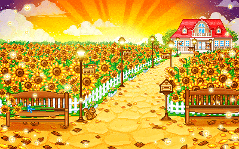

  

  

---

  

## About me

<ul>
  <li>🎓 Software Engineering graduate from <strong>FPT University Quy Nhon AI Campus</strong> (GPA: 8.66/10.0)</li>
   
  <li>⚙️ Specializing in <strong>C# & .NET Ecosystem</strong>, RESTful API design, and Clean Architecture.</li>
   
  <li>🤖 Using AI agents to accelerate engineering while retaining full technical ownership</li>
   
  <li>🤝 Open to <strong>Fresher / Junior .NET Backend Developer</strong> positions.</li>
   
  <li>📫 Email me: <a href="mailto:goldhoang.work@gmail.com">goldhoang.work@gmail.com</a> or <a href="mailto:huyhoangero@gmail.com">huyhoangero@gmail.com</a></li>
</ul>

 

---

## Technologies & Tools

  
    
  
  &nbsp;&nbsp;
  
  &nbsp;&nbsp;
  
    
  
  &nbsp;&nbsp;
  
  &nbsp;&nbsp;
  
    
  
  &nbsp;&nbsp;
  
  &nbsp;&nbsp;
  

---

## GitHub activity

  

  
  
  

  

---

## Contact

  I'm interested in backend and full-stack roles where reliability, thoughtful architecture, and product impact matter.

  
  &nbsp;&nbsp;&nbsp;&nbsp;
  
  &nbsp;&nbsp;&nbsp;&nbsp;
  
  &nbsp;&nbsp;&nbsp;&nbsp;
  
  &nbsp;&nbsp;&nbsp;&nbsp;
  

## Support me

  If you find my work useful, you can support its continued development.

  

  

